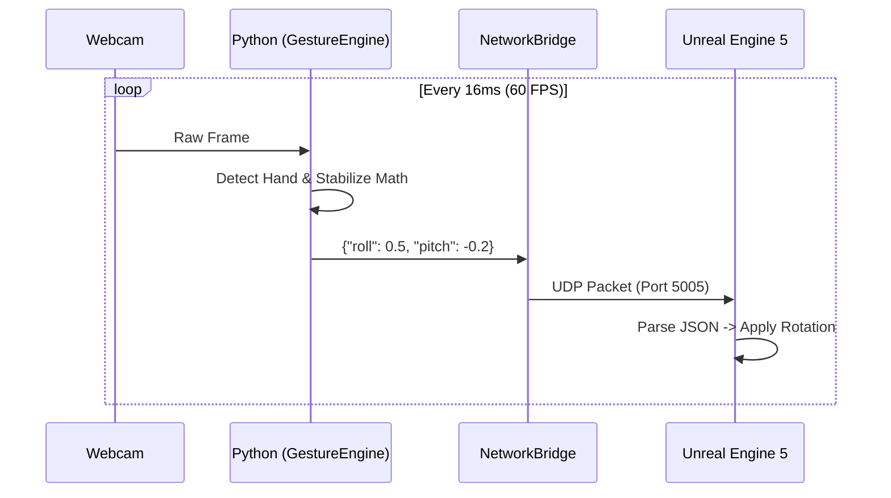

```markdown
# 🔌 Connecting AirplaneRoshan to Unreal Engine 5
### The Ultimate Integration & Architecture Guide

This document serves as the bridge between your **Python Vision System** and the **Unreal Engine 5 Physics System**. It explains the engineering behind the connection and provides a step-by-step tutorial to get your jet flying.

---

# 🧠 Part 1: The Architecture

Understanding the data flow is critical for debugging and expanding the project. We use a **Unidirectional UDP Telemetry Stream**.

### 1.1 The Communication Protocol: UDP
We use **UDP (User Datagram Protocol)** instead of TCP.
*   **TCP (Websites/Chat):** "Did you get the message? No? Okay, I'll resend it." (Slow, reliable).
*   **UDP (Games/Streaming):** "Here is data! Here is more data! Catch it if you can!" (Fast, fire-and-forget).

In a flight simulator, if we drop a packet (a millisecond of hand movement), we don't want to pause the game to wait for it. We just want the *next* packet. This ensures **Zero Latency**.

### 1.2 The Data Payload
Your Python script serializes the hand data into a **JSON String** before sending it over the network.

**The Packet Structure:**
```json
{
  "roll": 0.5432,   // Float (-1.0 to 1.0)
  "pitch": -0.8712, // Float (-1.0 to 1.0)
  "active": true    // Boolean
}
```

### 1.3 The Data Flow Diagram



---

# 🛠️ Part 2: Implementation Guide

Unreal Engine 5 does not have a "Listen to UDP" node enabled by default. You have two primary ways to achieve this.

## Method A: The Free Plugin (Recommended)
The easiest way is to use a community plugin like **"UDP Socket Receiver"** or **"Code Spartan UDP"** from the Unreal Marketplace (Free).

### Step 1: Create the Receiver Actor
1.  Open your UE5 project.
2.  Right-Click in Content Browser ➔ **Blueprint Class** ➔ **Actor**.
3.  Name it: `BP_NetworkBridge`.
4.  Drag this actor into your level.

### Step 2: Open the Connection
Open `BP_NetworkBridge` and go to the **Event Graph**.

1.  **Event BeginPlay** ➔ **Create UDP Socket Receiver**.
    *   **IP:** `127.0.0.1` (Localhost)
    *   **Port:** `5005` (Must match `config.py`)
    *   **Buffer Size:** `1024`

### Step 3: Parse the Data
Most plugins provide an event called **"On Data Received"**.

1.  **On Data Received** ➔ **Bytes to String**.
    *   *Result:* You now have the string `{"roll": 0.5, ...}`.
2.  **String** ➔ **Parse JSON** (Using a JSON plugin or string manipulation).
    *   Extract the `roll` value (Float).
    *   Extract the `pitch` value (Float).
3.  **Promote to Variables:**
    *   Save these as `TargetRoll` and `TargetPitch` inside the Blueprint.

---

## Method B: The Blueprint Logic (Flying the Plane)

Now that `BP_NetworkBridge` holds the data, your Plane needs to read it and move.

### Step 1: Open your Jet Pawn
Open the Blueprint for your airplane (e.g., `BP_FighterJet`).

### Step 2: Read the Network Data
In **Event Tick**:

1.  **Get All Actors of Class** (Select `BP_NetworkBridge`).
2.  **Get (0)** (Get the first one found).
3.  **Cast to BP_NetworkBridge** (if necessary).
4.  **Get TargetRoll** and **Get TargetPitch**.

### Step 3: Apply Physics (The Flight Model)
We don't just "set" the rotation; we "add" input to feel like a joystick.

**Blueprint Nodes:**
```text
Event Tick
   │
   ├─ [Multiply] (TargetRoll * RollSpeed * WorldDeltaSeconds) ➔ X
   ├─ [Multiply] (TargetPitch * PitchSpeed * WorldDeltaSeconds) ➔ Y
   │
   └─ AddActorLocalRotation (DeltaRotation: X, Y, 0)
```

> **⚠️ Crucial Math Note:**
> Python sends values from **-1.0 to 1.0**.
> If you apply this directly, the plane will barely move (1 degree per frame).
> You MUST multiply by a **Speed Factor** (e.g., 50.0 or 100.0) to convert "Joystick Intensity" into "Degrees per Second".

---

# 🐞 Troubleshooting & Common Errors

### 1. "I am moving my hand, but the plane does nothing."
*   **Check the Console:** Look at the Python terminal. Does it say `[UDP Error]`?
*   **Check the Firewall:** Windows Defender loves to block UDP. Disable the firewall temporarily or allow `python.exe`.
*   **Check the IP:** Ensure both `config.py` and UE5 are set to `127.0.0.1`.

### 2. "The plane spins wildly!"
*   **Axis Mismatch:** Unreal uses a Left-Handed Z-up coordinate system.
    *   Python `Roll (X)` might need to map to Unreal `Roll (X)`.
    *   Python `Pitch (Y)` might need to map to Unreal `Pitch (Y)`.
    *   *Fix:* Try swapping the pins in the **AddActorLocalRotation** node.
*   **Accumulation:** Are you using `SetActorRotation` or `AddActorLocalRotation`?
    *   `Add` = Joystick style (hold hand to keep turning).
    *   `Set` = Mouse style (hand position = exact angle).

### 3. "The movement is laggy/stuttering."
*   **Framerate Sync:** Ensure you are multiplying your rotation math by **Delta Seconds** in Unreal Engine.
*   **Smoothing:** Lower the `SMOOTHING_FACTOR` in `config.py` to `0.1`.

---

# 📐 Coordinate System Reference

When debugging, refer to this table to match Python data to Unreal World Space.

| Hand Motion | Python Axis | Data Value | Unreal Mapping (Standard) |
| :--- | :--- | :--- | :--- |
| **Left** | X | -1.0 | Roll - (Bank Left) |
| **Right** | X | +1.0 | Roll + (Bank Right) |
| **Up** | Y | -1.0 | Pitch + (Nose Up) * |
| **Down** | Y | +1.0 | Pitch - (Nose Down) * |

*\* Note: Pitch usually needs to be inverted depending on your preference settings in `config.py`.*

---

<p align="center">
  <b>Advanced Architecture Design by BishnuGautam1112</b>
</p>
```
