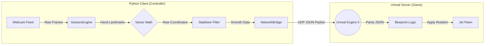

```markdown
<div align="center">

# ✈️ AirplaneRoshan Pro

> **"Control plane with just your hand moment!"** — *Actually, it's all hands.* 
> 
> **AirplaneRoshan Pro** transforms your standard webcam into a high-precision, zero-latency flight stick. By combining Google's MediaPipe Computer Vision with UDP networking, it allows you to fly 3D jets in Unreal Engine 5 using natural hand gestures.

---

## 📑 Table of Contents
1. [🌟 Key Features](#-key-features)
2. [🏗️ System Architecture](#%EF%B8%8F-system-architecture)
3. [🧠 How It Works (The Math)](#-how-it-works-under-the-hood)
4. [🚀 Installation Guide](#-installation-guide)
5. [🔌 Unreal Engine Integration](#-unreal-engine-integration)
6. [⚙️ Configuration](#%EF%B8%8F-configuration)
7. [🎮 Controls](#-flight-controls)
8. [🤝 Contribution](#-contribution)

---

## 🌟 Key Features

*   **⚡ Zero-Latency UDP Bridge:** Uses asynchronous socket communication to blast telemetry data to the game engine in real-time (60+ Hz).
*   **🌊 Liquid Smooth Technology:** Implements **Exponential Moving Average (EMA)** mathematical filters to eliminate webcam jitter, providing AAA-game quality control.
*   **🎮 Virtual Joystick Physics:** Calculates true analog input (0% to 100% intensity) based on hand distance from the center, identical to a physical HOTAS controller.
*   **🛡️ Enterprise-Grade Modularity:** Clean, class-based code structure (`GestureEngine`, `Stabilizer`, `NetworkBridge`) designed for scalability.
*   **🔌 Plug-and-Play:** Auto-detects camera hardware and handles network errors gracefully.

---

## 🏗️ System Architecture

The project operates on a **Client-Server model**. The Python script acts as the Input Controller (Client), and Unreal Engine acts as the Physics Simulation (Server).



### The Data Packet
Every frame, the Python client sends a lightweight JSON packet to `127.0.0.1:5005`:

```json
{
  "roll": 0.542,
  "pitch": -0.123,
  "active": true
}
```

---

## 🧠 How It Works (Under the Hood)

This isn't just "if hand left, go left." We use vector mathematics to create a virtual analog stick.

### 1. The Coordinate System
MediaPipe returns hand landmarks normalized between `[0.0, 1.0]`.
*   **Wrist Center:** `(0.5, 0.5)`
*   **Left Edge:** `0.0`
*   **Right Edge:** `1.0`

### 2. The Vector Calculation
We calculate the deviation ($\Delta$) of the wrist from the center of the screen:
$$ \Delta x = \text{Wrist}_x - 0.5 $$
$$ \Delta y = \text{Wrist}_y - 0.5 $$

### 3. The Deadzone
To prevent the plane from drifting when your hand shakes slightly in the center, we apply a **Deadzone Clamp**:
If $| \Delta x | < \text{Threshold}$, then $\Delta x = 0$.

### 4. Sensitivity & Mapping
We multiply the deviation by a `SENSITIVITY` factor and clamp it to physical limits:
$$ \text{Roll} = \text{clamp}(\Delta x \times \text{Sensitivity}, -1.0, 1.0) $$

### 5. Signal Stabilization (EMA)
Raw webcam data is noisy. To make the flight smooth, we use an **Exponential Moving Average** filter. This acts like a virtual shock absorber.
$$ S_t = \alpha \cdot X_t + (1 - \alpha) \cdot S_{t-1} $$
*   $S_t$: The new smoothed value.
*   $X_t$: The raw input from the camera.
*   $\alpha$: The smoothing factor (defined in `config.py`).

---

## 🚀 Installation Guide

### Prerequisites
*   Python 3.10 or 3.11 (Python 3.13 is NOT supported by MediaPipe yet).
*   A Webcam.
*   Unreal Engine 4.27 or 5.x.

### Step 1: Clone the Repository
```bash
git clone https://github.com/R00SHAN/AirplaneRoshan.git
cd AirplaneRoshan
```

### Step 2: Setup Environment
It is highly recommended to use a virtual environment.

```bash
# Windows
python -m venv .venv
.\.venv\Scripts\activate

# Mac/Linux
python3 -m venv .venv
source .venv/bin/activate
```

### Step 3: Install Dependencies
This project requires specific versions of MediaPipe and Protobuf to function correctly.

```bash
pip install -r requirements.txt
```
*(If `requirements.txt` is missing, run: `pip install mediapipe==0.10.9 protobuf==3.20.3 opencv-python numpy`)*

### Step 4: System Check
Run the diagnostic tool to ensure everything is ready.
```bash
python system_check.py
```
If you see **[ OK ]** across the board, you are ready to fly.

---

## 🔌 Unreal Engine Integration

To make your jet respond to Python, follow these steps in Unreal Engine 5.

### A. Enable Plugins
1.  Open UE5.
2.  Go to **Edit > Plugins**.
3.  Search for **"UDP Messaging"** or download the free **"UDP Socket Receiver"** from the Marketplace.

### B. The Blueprint Logic
In your **Jet Pawn Blueprint**:

1.  **Event BeginPlay:** Create a UDP Socket Receiver bound to `127.0.0.1` Port `5005`.
2.  **On Data Received:**
    *   Convert Bytes to String.
    *   Parse the JSON String into `TargetRoll` and `TargetPitch` floats.
3.  **Event Tick:**
    *   Use `AddActorLocalRotation`.
    *   **Roll Input:** `TargetRoll * TurnSpeed * DeltaSeconds`.
    *   **Pitch Input:** `TargetPitch * TurnSpeed * DeltaSeconds`.

> **💡 Pro Tip:** Always multiply by `DeltaSeconds` to ensure smooth movement regardless of frame rate.

---

## ⚙️ Configuration

You can tweak the feel of the flight without touching the code. Open `config.py`:

| Parameter | Default | Description |
| :--- | :--- | :--- |
| `UDP_IP` | "127.0.0.1" | IP Address of the game engine. |
| `UDP_PORT` | 5005 | Port to send data to. |
| `SMOOTHING_FACTOR` | 0.15 | **0.1** = Heavy/Slow, **0.9** = Twitchy/Fast. |
| `DEADZONE` | 0.12 | How much center movement to ignore (0.0 to 0.5). |
| `SENSITIVITY` | 1.6 | Multiplier for hand movement. |
| `INVERT_PITCH` | False | Set `True` for Flight Sim controls (Pull back to climb). |

---

## 🎮 Flight Controls

The system uses a **Virtual Joystick** method. Imagine an invisible stick in the center of your camera frame.

| Gesture | Movement | Data Sent | Effect |
| :--- | :--- | :--- | :--- |
| **Move Hand Right** | Roll Right | `roll > 0` | Plane banks Right |
| **Move Hand Left** | Roll Left | `roll < 0` | Plane banks Left |
| **Move Hand Up** | Pitch Up | `pitch < 0` | Plane Nose Up (Climb) |
| **Move Hand Down** | Pitch Down | `pitch > 0` | Plane Nose Down (Dive) |
| **Remove Hand** | Auto-Level | `roll: 0, pitch: 0` | Plane stabilizes automatically |

---

## 🤝 Contribution

This project is open-source and we welcome contributions! 

**Current Contributors:**
*   **R00SHAN** - Original Creator
*   **BishnuGautam1112** - Lead Refactor Engineer & Architecture Design

### How to contribute:
1.  Fork the repo.
2.  Create a feature branch (`git checkout -b feature/AmazingNewFeature`).
3.  Commit your changes.
4.  Push to the branch.
5.  Open a Pull Request.

---

## 📄 License

Distributed under the **MIT License**. See `LICENSE` for more information.

---

<p align="center">
  <b>Built with ❤️ by Developers, for Developers.</b><br>
  <i>Fly safe, Pilot.</i>
</p>
```
